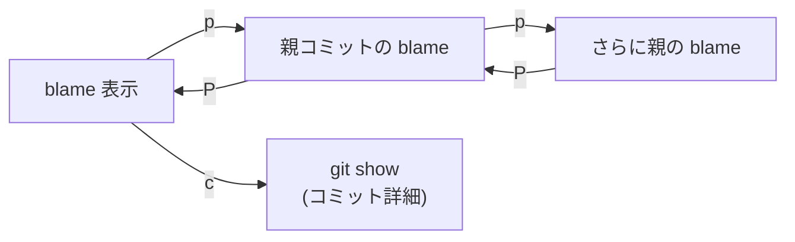

# Git 連携

> "Those who cannot remember the past are condemned to repeat it." — George Santayana

## この章で学ぶこと

- Git コマンドの使い方
- blame, status, diff, log, branch, commit, grep

バージョン管理はソフトウェア開発の基盤です。エディタの中から直接 Git を操作できると、「コードを書く → 差分を確認 → コミットする」という流れが途切れません。blame で「誰がなぜこう書いたか」を即座に調べられるのも、コードの理解に大きく貢献します。

## Git コマンドへのアクセス

```
Ctrl-g    ":git " がプリセットされたコマンドラインに入る
:git <subcmd>    Git サブコマンドを実行
```

## Git Blame

```
:git blame
```

- ガター（行番号エリア）にコミットハッシュ・著者名・日付を表示
- 元ファイルの filetype に基づくシンタックスハイライトが適用される
- blame バッファ内のキー:
  - `p` — 親コミットの blame へ遷移
  - `P` — 前の blame に戻る
  - `c` — カーソル行のコミット詳細（`git show`）を表示



## Git Status

```
:git status
```

`git status` の結果を読み取り専用バッファで表示します。

## Git Diff

```
:git diff
:git diff --cached
```

diff 結果を表示します（filetype: diff でハイライト）。`Enter` で差分行の対応ファイルにジャンプできます。

## Git Log

```
:git log
:git log -p          パッチ付き（diff ハイライト）
:git log --oneline
```

ストリーミングで逐次表示されます。バッファを閉じるとプロセスも停止します。`-p` 指定時は diff のシンタックスハイライトが適用されます。

## Git Branch

```
:git branch
```

ブランチ一覧を表示（コミット日時の新しい順）。各行にブランチ名・日付・最新コミットのサブジェクトを表示。

`Enter` で `:git checkout <branch>` がコマンドラインにプリフィルされます（即時実行ではなく確認ステップ付き）。

## Git Commit

```
:git commit
```

コミットメッセージ編集バッファが開きます。`#` で始まる行はコメント（git status 情報）。Insert mode で開始。`:w` または `:wq` でコミット実行、`:q\!` でキャンセル。

## Git Grep

```
:git grep pattern
:git grep -i pattern
```

`git grep -n` を実行し、結果バッファで `Enter` を押すと該当ファイルの該当行にジャンプします。

## その他の Git コマンド

未知のサブコマンドはシェルで直接実行されます。

```
:git stash
:git rebase -i HEAD~3
```

Tab 補完で git サブコマンドを補完できます。
