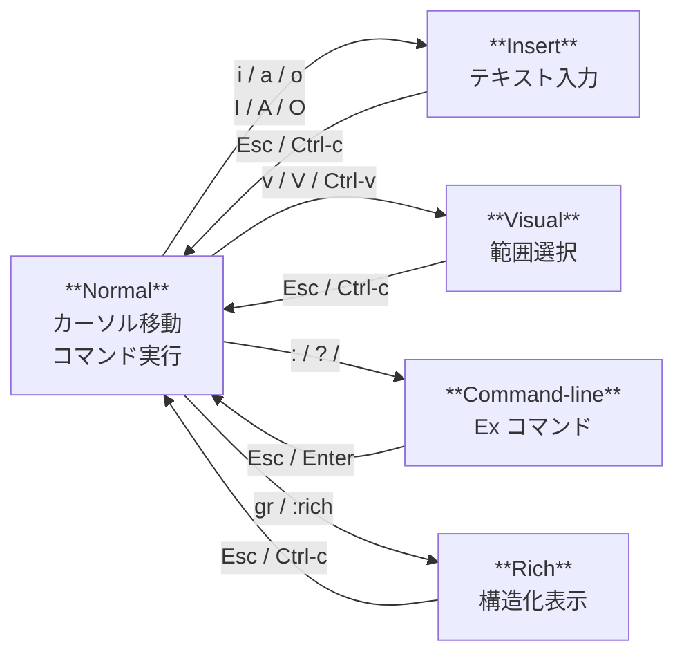

# RuVimとは

> "I think that it's extraordinarily important that we in computer science keep fun in computing." — Alan J. Perlis

## この章で学ぶこと

- RuVim の概要とインストール方法
- 起動と終了の方法
- モードの概念

新しいエディタを学ぶのは、新しい楽器を手に取るようなものです。最初は戸惑いますが、基本さえ押さえれば、あとは自然と指が覚えていきます。この章では RuVim の全体像と、まず最低限必要な「起動・入力・保存・終了」を身につけます。ここをクリアすれば、もう RuVim で実際の仕事を始められます。

## RuVim の概要

RuVim は Ruby で実装された Vim ライクなターミナルエディタです。Ruby 標準ライブラリのみで動作し、Vim の操作感を維持しつつ、Ruby ネイティブな拡張性を備えています。

主な特徴:

- Vim 互換のモーダル編集（Normal / Insert / Visual / Command-line モード）
- Ruby DSL による設定とプラグイン
- 26 言語のシンタックスハイライト
- TSV/CSV/Markdown/JSON/画像の Rich View モード
- Git / GitHub 連携
- ストリーム連携（stdin パイプ、`:run`、`:follow`）

## インストール

RuVim は gem としてインストールできます。

```bash
gem install ruvim
```

開発環境で直接実行する場合:

```bash
ruby -Ilib exe/ruvim
```

## 起動

ファイルを指定して起動:

```bash
ruvim file.txt
```

ファイル指定なしで起動すると、Vim 風の intro screen が表示されます:

```bash
ruvim
```

複数ファイルを開く:

```bash
ruvim file1.txt file2.txt file3.txt
```

レイアウトを指定して複数ファイルを開く:

```bash
ruvim -o file1.txt file2.txt    # 水平分割
ruvim -O file1.txt file2.txt    # 垂直分割
ruvim -p file1.txt file2.txt    # タブ
```

特定の行から開く:

```bash
ruvim +10 file.txt              # 10行目へジャンプ
ruvim + file.txt                # 最終行へジャンプ
ruvim file.txt:10               # path:line 形式でも可
ruvim file.txt:10:5             # path:line:col 形式
```

## モードの概念

RuVim は Vim と同様に「モーダル」なエディタです。モードによってキーの意味が変わります。

| モード | 説明 | 入り方 | 抜け方 |
|--------|------|--------|--------|
| Normal | カーソル移動・コマンド実行 | `Esc` | — |
| Insert | テキスト入力 | `i`, `a`, `o` など | `Esc`, `Ctrl-c` |
| Visual | 範囲選択 | `v`, `V`, `Ctrl-v` | `Esc`, `Ctrl-c` |
| Command-line | Ex コマンド入力 | `:`, `/`, `?` | `Enter`(実行), `Esc`(取消) |
| Rich | 構造化データ閲覧 | `gr`, `:rich` | `Esc`, `Ctrl-c` |

起動直後は **Normal mode** です。

モードの遷移を図で示すと:



## 終了

```
:q        通常終了（未保存変更があるとエラー）
:q\!       強制終了（未保存変更を破棄）
:wq       保存して終了
:qa       全ウィンドウ/タブを閉じて終了
:qa\!      強制的に全終了
:wqa      全バッファ保存して終了
```

操作例 — ファイルを開いて保存して終了:

```
$ ruvim hello.txt
（Normal mode で）
i                    ← Insert mode に入る
Hello, RuVim\!        ← テキストを入力
Esc                  ← Normal mode に戻る
:wq Enter            ← 保存して終了
```

## サスペンド

全モード共通で `Ctrl-z` を押すとシェルに戻ります（サスペンド）。`fg` で復帰できます。
