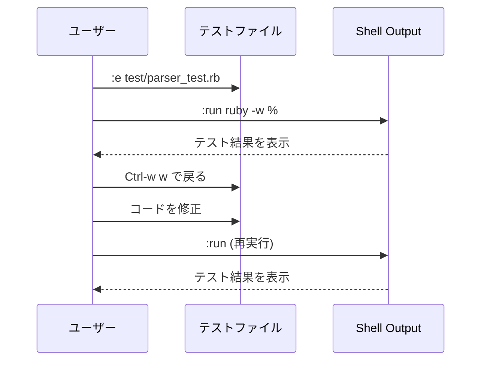

# ストリーム連携

> "Data is not information, information is not knowledge, knowledge is not wisdom." — Clifford Stoll

## この章で学ぶこと

- stdin パイプ
- `:run` コマンド
- `:follow` コマンド
- 非同期ファイルロード

外部コマンドの出力やログファイルの更新をリアルタイムにエディタ内で確認できるのは、RuVim の大きな強みです。ターミナルマルチプレクサを使わなくても、`:run` でテストを実行しながら結果を確認したり、`:follow` でログを監視したりできます。データの「流れ」をエディタで捉えましょう。

## stdin パイプ

コマンドの出力を RuVim にパイプできます:

```bash
cat file.txt | ruvim
ls -la | ruvim
git log | ruvim
```

- バッファ名は `[stdin]`
- Normal mode の `Ctrl-c` でストリームを停止
- 完了時: `[stdin/EOF]`、失敗時: `[stdin/error]`

## `:run` コマンド

```
:run command         コマンドを実行し、出力を [Shell Output] バッファに表示
:run ruby %          現在ファイルを Ruby で実行
:run                 直前のコマンドを再実行（または runprg の値）
```

- PTY 経由でリアルタイム出力
- `Ctrl-C` で停止
- `%` は現在のファイル名に展開
- 変更のあるバッファは実行前に自動保存
- statusline に実行状態を表示

ファイルタイプ別のデフォルト `runprg`:

| filetype | runprg |
|----------|--------|
| ruby | `ruby -w %` |
| python | `python3 %` |
| c | `gcc -Wall -o /tmp/a.out % && /tmp/a.out` |
| cpp | `g++ -Wall -o /tmp/a.out % && /tmp/a.out` |
| scheme | `gosh %` |
| javascript | `node %` |

実践例 — テスト駆動開発ワークフロー:



## `:follow` コマンド

```
:follow              follow mode 開始（トグル）
ruvim -f file.log    起動時から follow mode
```

ファイルへの追記をリアルタイムにバッファへ反映する `tail -f` 相当の機能です。

- カーソルが最終行（`G`）にいると末尾を自動追従
- 途中にいるとスクロール位置を維持
- `Ctrl-C` や再度 `:follow` で停止
- follow 中はバッファ変更不可
- ファイルの truncate/削除を検知して対応
- Linux では inotify を優先、使えない場合は polling

## 非同期ファイルロード

大きなファイル（デフォルト閾値以上）を開くと:

1. 先頭 8MB を先に表示
2. 残りをバックグラウンドでチャンク単位で読み込み
3. statusline に `[load]` と表示（完了で消える）

```
:set syncload        同期ロードに切替（非同期を無効化）
:set nosyncload      非同期に戻す
```

環境変数で閾値を調整:

```bash
RUVIM_ASYNC_FILE_THRESHOLD_BYTES=16777216 ruvim huge.log
RUVIM_ASYNC_FILE_PREFIX_BYTES=4194304 ruvim huge.log
```
