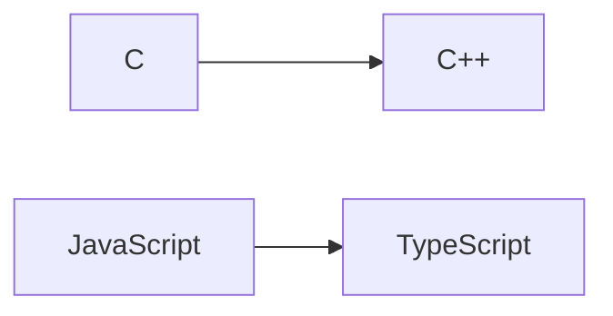
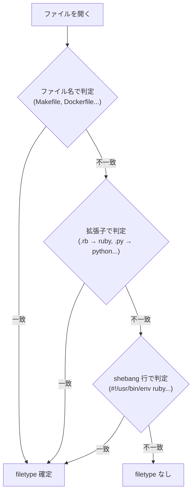

# シンタックスハイライトと言語サポート

> "Color is a power which directly influences the soul." — Wassily Kandinsky

## この章で学ぶこと

- 対応言語の一覧
- filetype 検出の仕組み
- オートインデント
- on_save フック

[シンタックスハイライト](#index:シンタックスハイライト)は「目が先にコードの構造を把握する」ための仕組みです。キーワード、文字列、コメントが色分けされていると、コードの意図を読み取る速度が格段に上がります。RuVim は 26 言語に対応し、言語ごとの自動インデントや保存時チェックも備えています。

## 対応言語（26言語）

RuVim は以下の言語のシンタックスハイライトに対応しています:

| 言語 | filetype | インデント | on_save |
|------|----------|-----------|---------|
| Ruby | ruby | あり | `ruby -wc` 構文チェック |
| JSON | json | あり | — |
| JSONL | jsonl | — | — |
| Markdown | markdown | — | — |
| Scheme | scheme | — | — |
| C | c | あり | `gcc` チェック |
| C++ | cpp | あり | `g++` チェック |
| Diff | diff | — | — |
| YAML | yaml | あり | — |
| Shell/Bash | sh | あり | — |
| Python | python | あり | — |
| JavaScript | javascript | あり | — |
| TypeScript | typescript | あり | — |
| HTML | html | — | — |
| TOML | toml | — | — |
| Go | go | あり | — |
| Rust | rust | あり | — |
| Makefile | make | — | — |
| Dockerfile | dockerfile | — | — |
| SQL | sql | — | — |
| Elixir | elixir | あり | — |
| Perl | perl | あり | — |
| Lua | lua | あり | — |
| OCaml | ocaml | あり | — |
| ERB | erb | — | — |
| Git commit | gitcommit | — | — |

加えて TSV, CSV, 画像ファイル（PNG/JPG/GIF/BMP/WEBP）は [Rich View](ch-rich-view.md) 用の filetype として検出されます。

言語モジュールの継承関係:



C++ は C のハイライトルールを継承し、TypeScript は JavaScript を継承しています。

## filetype 検出

ファイルを開くと、以下の順で filetype を検出します:



手動で filetype を変更:

```
:set filetype=python
```

## オートインデント

`autoindent` がデフォルトで有効です。改行時に前行のインデントを引き継ぎます。

`smartindent` も有効で、前行が `{`, `[`, `(` で終わる場合に `shiftwidth` 分のインデントを追加します。

Ruby filetype では `=` オペレータでネスト構造に基づく自動インデントが適用されます。

## on_save フック

ファイル保存時に lang モジュールの `on_save` フックが呼ばれます。

- Ruby: `ruby -wc` で構文チェック → エラーを [quickfix list](ch-search-workflow.md#quickfix-list) に展開
- C: `gcc` でチェック
- C++: `g++` でチェック

> [!NOTE]
> on_save フックが不要な場合は無効化できます:

```
:set noonsavehook     保存時フックを無効化
:set onsavehook       有効に戻す
```
