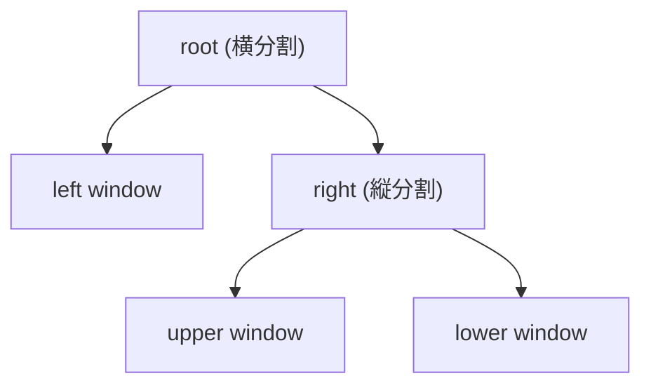

# ウィンドウ分割

> "Divide each difficulty into as many parts as is feasible to solve it." — Rene Descartes

## この章で学ぶこと

- 水平/垂直分割
- ウィンドウ間の移動
- ウィンドウのサイズ調整とクローズ
- ネスト分割

テストを書きながら実装を見たい。ログを監視しながらコードを書きたい。ウィンドウ分割を使えば、画面を分割して複数のファイルを同時に見ることができます。1つのターミナルの中で完結するため、tmux や別のターミナルウィンドウを用意する必要がありません。

## ウィンドウの分割

```
:split       水平分割（上下）
:vsplit      垂直分割（左右）
```

分割すると、同じバッファを2つのウィンドウで表示します。それぞれ独立したカーソル位置とスクロール位置を持ちます。

別のファイルを分割して開くには:

```
:split other.txt
:vsplit other.txt
```

実践例 — テストと実装を並べて表示:

```
:e lib/parser.rb              ← 実装ファイルを開く
:vsplit test/parser_test.rb   ← テストファイルを右に分割表示

┌──────────────────┬──────────────────┐
│ lib/parser.rb    │ test/parser_test │
│                  │ .rb              │
│ def parse(input) │ def test_parse   │
│   ...            │   assert_equal(  │
│ end              │     expected,    │
│                  │     parse(input) │
│                  │   )              │
│                  │ end              │
└──────────────────┴──────────────────┘
```

## ウィンドウ間の移動

```
Ctrl-w w     次のウィンドウへ
Ctrl-w h     左のウィンドウへ
Ctrl-w j     下のウィンドウへ
Ctrl-w k     上のウィンドウへ
Ctrl-w l     右のウィンドウへ
```

`Shift+矢印キー` でも移動できます（1ウィンドウのときは自動で分割）。

## ウィンドウのクローズ

```
Ctrl-w c     現在ウィンドウを閉じる
:q           現在ウィンドウを閉じる（最後のウィンドウなら終了）
Ctrl-w o     他の全ウィンドウを閉じる
```

## ウィンドウのサイズ調整

```
Ctrl-w +     高さを増やす
Ctrl-w -     高さを減らす
Ctrl-w >     幅を増やす
Ctrl-w <     幅を減らす
Ctrl-w =     全ウィンドウのサイズを均等化
```

## 分割方向の制御

```
:set splitbelow     :split 時に下に分割
:set splitright     :vsplit 時に右に分割
```

## ネスト分割

RuVim はツリー構造のレイアウトをサポートしています。`:vsplit` 後に `:split` すると、右ウィンドウだけが上下に分割されます。



同方向の連続分割は自動的にフラット化されます。
